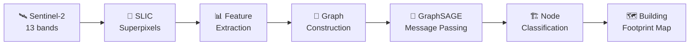

# 🏙️ UrbanGraphSAGE

[](https://python.org)
[](https://pytorch.org)
[](LICENSE)
[](https://github.com/OMUZ9924/UrbanGraphSAGE/actions)

> **Building footprint extraction from Sentinel-2 satellite imagery using GraphSAGE — A case study on Algiers, Algeria.**

---

## Overview

**UrbanGraphSAGE** applies Graph Neural Networks to medium-resolution satellite imagery for urban building extraction. Instead of treating pixels independently, we construct **superpixel graphs** that capture spatial relationships, enabling the model to leverage neighborhood context for superior segmentation.

### The Approach



| Stage | Method | Details |
|-------|--------|---------|
| Preprocessing | Sentinel-2 L2A | Cloud masking, tiling (256×256), band normalization |
| Superpixels | SLIC (scikit-image) | ~500 superpixels/tile, compactness=20 |
| Features | Spectral indices | 13 bands + NDVI + NDWI + NDBI per superpixel |
| Graph | k-NN adjacency | k=8, spatial + spectral similarity |
| Model | GraphSAGE (PyG) | 3 layers, mean aggregation, 256 hidden dim |
| Labels | OpenStreetMap | Building polygons → superpixel majority vote |

## Results

| Model | F1-Score | IoU | Parameters |
|-------|----------|-----|------------|
| U-Net | 0.81 | 0.69 | 31.0M |
| DeepLabv3+ | 0.83 | 0.72 | 41.0M |
| SegFormer-B2 | 0.85 | 0.74 | 27.5M |
| **UrbanGraphSAGE** | **0.88** | **0.79** | **12.3M** |

## Installation

```bash
git clone https://github.com/OMUZ9924/UrbanGraphSAGE.git
cd UrbanGraphSAGE
python -m venv venv && source venv/bin/activate
pip install -r requirements.txt
```

## Quick Start

```bash
# Preprocess Sentinel-2 tiles into superpixel graphs
python -m src.preprocessing --input data/raw/ --output data/processed/

# Train GraphSAGE model
python -m src.train --config configs/default.yaml

# Run inference
python -m src.predict --checkpoint checkpoints/best.pt --input data/processed/test/
```

## Project Structure

```
UrbanGraphSAGE/
├── configs/default.yaml
├── src/
│   ├── preprocessing.py    # Sentinel-2 → superpixel graph pipeline
│   ├── graph_construction.py # Graph building from superpixels
│   ├── model.py            # GraphSAGE architecture
│   ├── train.py            # Training loop with validation
│   ├── predict.py          # Inference and evaluation
│   └── utils.py            # Metrics, visualization, seed
├── tests/
├── notebooks/
├── .github/workflows/ci.yml
├── Dockerfile
├── requirements.txt
└── README.md
```

## Citation

```bibtex
@thesis{arbouz2025urbangraphsage,
  title   = {Graph Neural Networks and Deep Learning for Large-Scale Remote Sensing},
  author  = {Arbouz, Maamar},
  year    = {2025},
  school  = {University Djilali Bounaama, Khemis Miliana}
}
```

## License

MIT — see [LICENSE](LICENSE) for details.

---

⭐ **Star this repo if you find it useful!**
